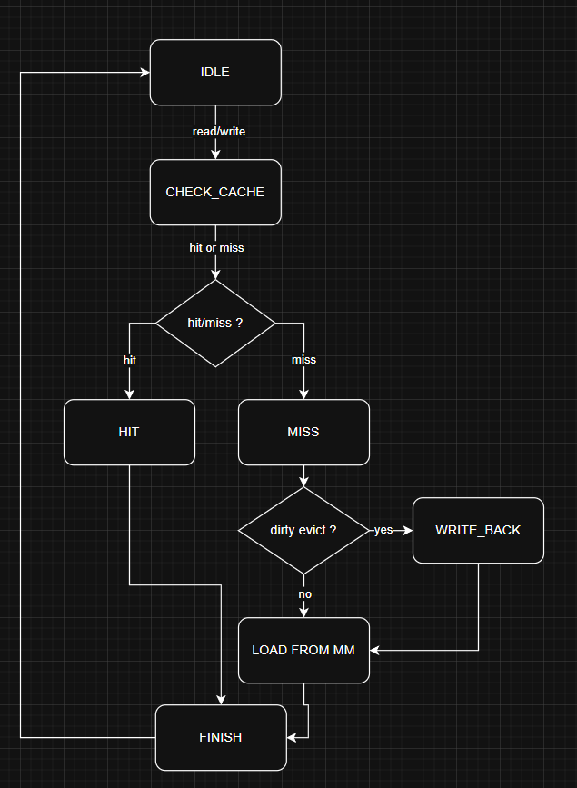
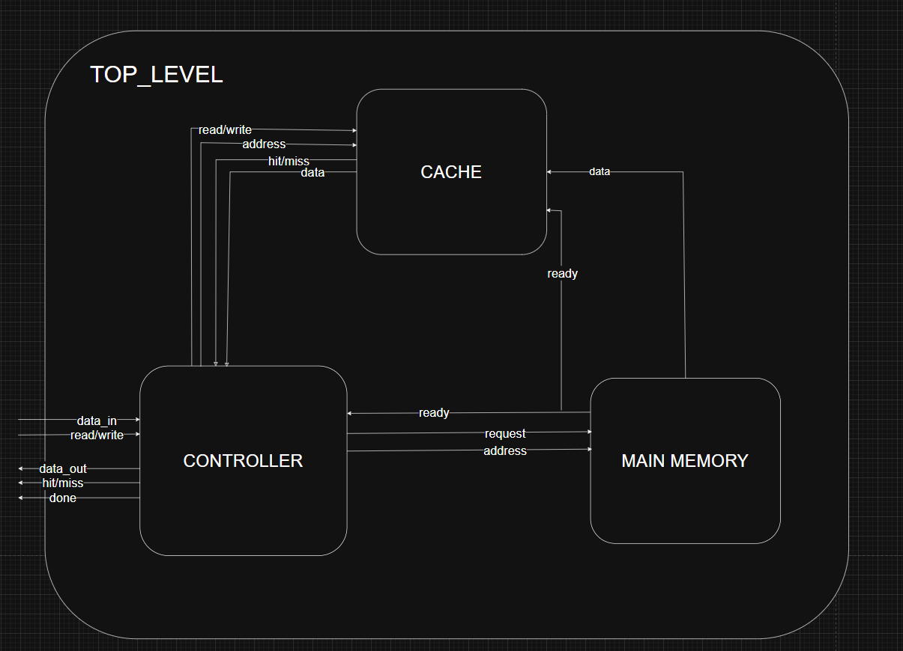

# Cache Controller Project

## Overview

This project implements a 4-way set-associative cache controller with a total cache size of 32KB. It supports both read and write operations and is designed to simulate realistic CPU-cache interactions.

The design is modular, with clear separation between:

- Cache control logic  
- Memory interface  
- Testbench with address access simulations and miss rate analysis  

## Finite State Machine

## Diagram

## Performance Analysis

- **Hit latency**: 4 clock cycles  
- **Miss penalty**: 100 clock cycles (artificially simulated)  
- **Cache size**: 32KB total (128 sets × 4 ways × 64 bytes per block)  
- **Miss Rates**: ~49% miss rate when accessing a 64KB address region
- **AMAT**: 53 clock cycles 64KB address region    

More information about miss rates in the next section.

## Conclusions

Based on simulations across various address ranges and instruction counts, several insights emerged about the relationship between miss rate, main memory size, and the number of accesses:

- The miss rate increases sharply when the addressable memory significantly exceeds the cache size.
- The miss rate gradually decreases as the cache fills up over time.

It's important to note that these simulation results differ from real-world cache behavior. Actual workloads benefit from temporal and spatial locality—where certain addresses are accessed more frequently than others—resulting in much lower miss rates in practice.

## Resources

- [ModelSim](https://www.intel.com/content/www/us/en/software-kit/750368/modelsim-intel-fpgas-standard-edition-software-version-18-1.html) - simulating the project
- [Drawio](https://www.drawio.com) - the diagrams and flowcharts seen in this README
